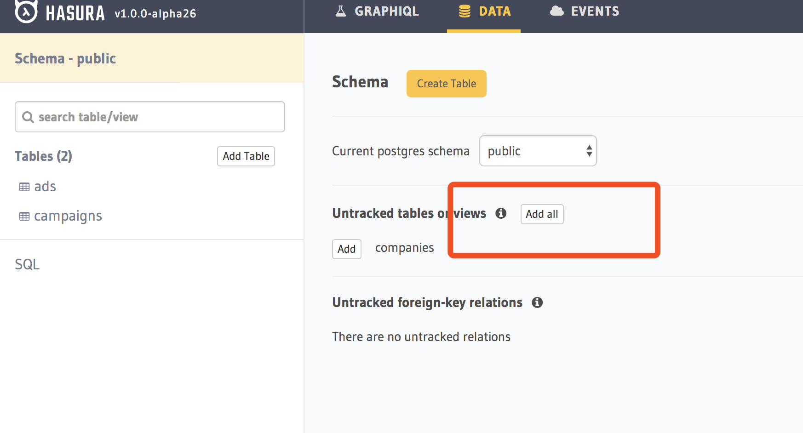
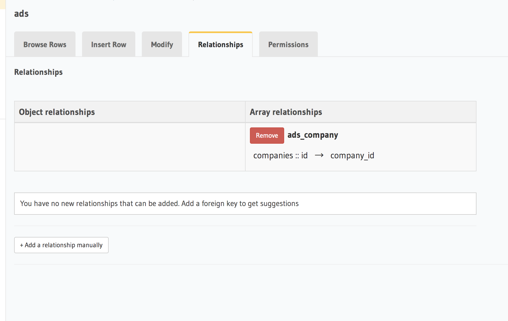
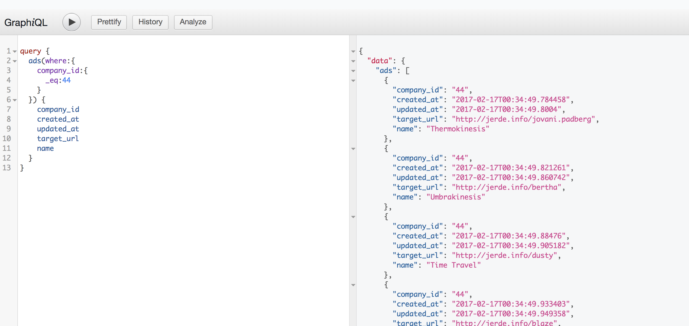

# citus hasura graphql integration 

## How to run

* start db && graphql engine

```code
docker-compose up -d
```

* create table

```code
CREATE TABLE companies (
    id bigint NOT NULL,
    name text NOT NULL,
    image_url text,
    created_at timestamp without time zone NOT NULL,
    updated_at timestamp without time zone NOT NULL
);

CREATE TABLE campaigns (
    id bigint NOT NULL,
    company_id bigint NOT NULL,
    name text NOT NULL,
    cost_model text NOT NULL,
    state text NOT NULL,
    monthly_budget bigint,
    blacklisted_site_urls text[],
    created_at timestamp without time zone NOT NULL,
    updated_at timestamp without time zone NOT NULL
);

CREATE TABLE ads (
    id bigint NOT NULL,
    company_id bigint NOT NULL,
    campaign_id bigint NOT NULL,
    name text NOT NULL,
    image_url text,
    target_url text,
    impressions_count bigint DEFAULT 0,
    clicks_count bigint DEFAULT 0,
    created_at timestamp without time zone NOT NULL,
    updated_at timestamp without time zone NOT NULL
);


```

* modify table relationship

```code
ALTER TABLE companies ADD PRIMARY KEY (id);
ALTER TABLE campaigns ADD PRIMARY KEY (id, company_id);
ALTER TABLE ads ADD PRIMARY KEY (id, company_id);
```

* create distributed table

```code
SELECT create_distributed_table('companies', 'id');
SELECT create_distributed_table('campaigns', 'company_id');
SELECT create_distributed_table('ads', 'company_id');
```

* load data

> use copy or some ui tools

```code
\copy companies from 'companies.csv' with csv
\copy campaigns from 'campaigns.csv' with csv
\copy ads from 'ads.csv' with csv
```

* add grphql support



* add some relationships

> just for test add ads with companies relationship



* some  queries



## some notes

some sql not supported by citus,the  best way is to see the limits in  Official 
website docs
